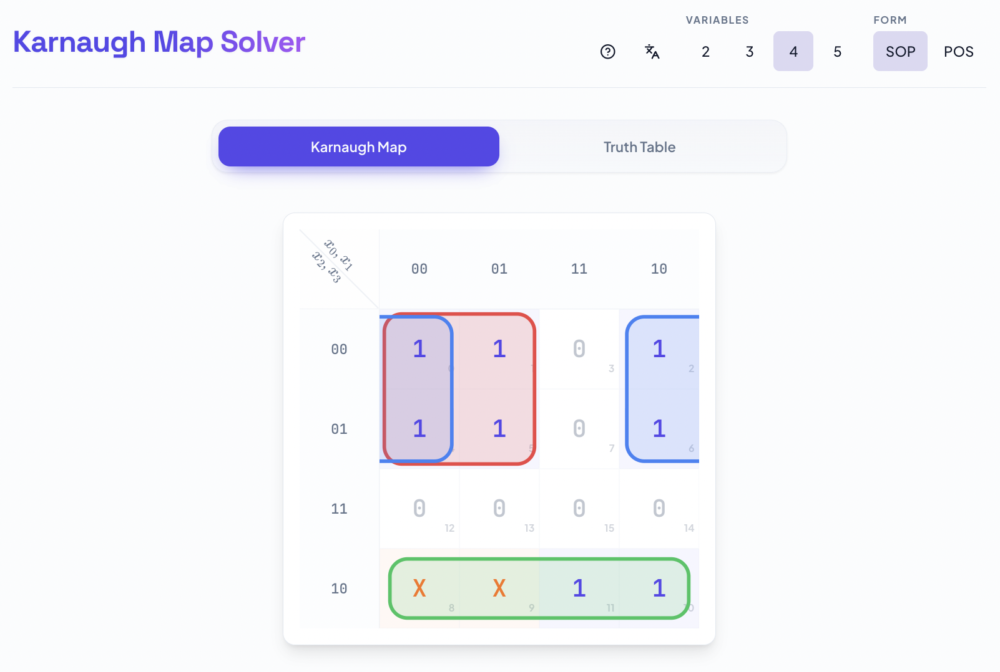
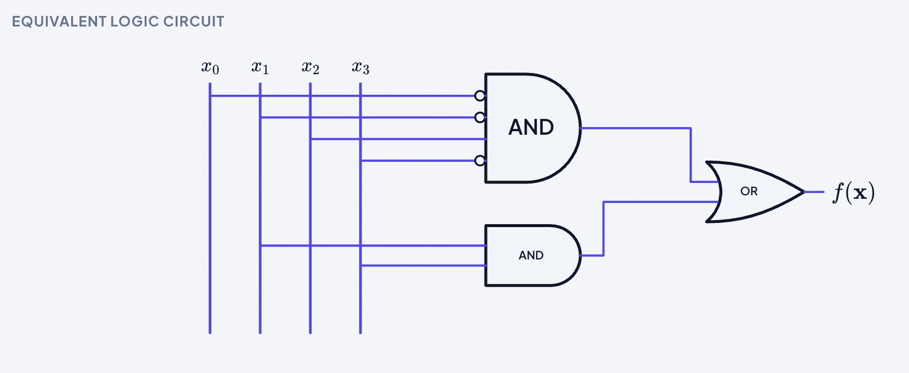

# K-Map Solver

K-Map Solver is a client-side web application for Boolean function minimization based on Karnaugh maps and the Quine-McCluskey method.
The application is implemented with React, TypeScript, Vite, and Tailwind CSS.

## Project Goals

- Provide an interactive tool for Karnaugh map analysis (2 to 5 variables)
- Support both SOP (Sum of Products) and POS (Product of Sums) minimization
- Keep all computations local in the browser (no backend dependency)
- Offer an educational visualization of the equivalent logic circuit

## Core Features

- Interactive Karnaugh map editing (`0`, `1`, don't-care)
- Truth table editing in a dedicated tab with real-time synchronization
- Quine-McCluskey minimization engine implemented in the codebase
- Decimal canonical representation (`Σ`/`Π`) and minimized expression rendering with MathJax
- Equivalent logic circuit visualization with input bus, orthogonal wiring, and logic gates
- Bilingual interface (Italian/English)

## User Workflow

1. Select number of variables (`2` to `5`) and minimization form (`SOP` or `POS`)
2. Populate values from the Karnaugh map or from the truth table tab
3. Run minimization with `Solve`
4. Review:
   - canonical decimal form
   - minimized expression
   - equivalent logic circuit

## User Story / Screenshot

A screenshot is recommended for this project because the value of the application is strongly visual (map interaction, grouping, and circuit rendering).
The standard location is:

- `docs/images/`

Primary screenshots:

```text
docs/images/app-overview.png
docs/images/circuit-overview.png
```

## Interface Preview




## Technology Stack

- React 19
- TypeScript 5
- Vite 7
- Tailwind CSS 3
- Framer Motion
- MathJax

## Local Development

Clone the repository:

```bash
git clone https://github.com/M4rulli/K-Map-Solver.git
cd K-Map-Solver
```

Install dependencies:

```bash
npm install
```

Run development server:

```bash
npm run dev
```

Build production bundle:

```bash
npm run build
```

## Repository Structure

- `src/components/` UI components (K-map, truth table, logic circuit, modals)
- `src/lib/` minimization logic and utility modules
- `public/` static assets and icons
- `config/` Vite, TypeScript, Tailwind, ESLint configuration

## License

This project is licensed under the GNU General Public License v3.0 (GPL-3.0).
See `LICENSE` for full terms.
